<div align="center">

# Easy Trip

### 在找一个顺手好用的行程规划 App？

把每天去哪、几点到、怎么走，放在一张行程里。

**Easy Trip 只帮你做好旅行规划，不干别的。**

[查看 / 下载最新正式版](https://github.com/chengweiv5/easy-trip/releases/latest) · [看看能做什么](#features) · [从源码构建](#development)

**Android 8.0+ · 五套浅色主题 · 无需账号 · 旅行数据保存在本机**

</div>

### 同一家酒店，可以是当天的第一站，也是最后一站

有的 App 不让重复添加地点。可早上从酒店出发，晚上还要回酒店，我就是想把这两段都排进行程，时间和路线才算完整。

Easy Trip 支持**同一地点重复加入行程**。酒店、餐厅、景点，想再去一次，就再排一站；每次到访都可以单独设置到达时间和停留时长。

> 酒店 → 西湖 → 餐厅 → 酒店

从出门到回酒店，把当天每一站和往返交通都规划进去。收藏地点、调整顺序、查看路线，专心把自己的旅行安排好。

> 当前正式版为 **[v1.6.0](https://github.com/chengweiv5/easy-trip/releases/tag/v1.6.0)**。[下载 APK](https://github.com/chengweiv5/easy-trip/releases/download/v1.6.0/easy-trip-v1.6.0-release.apk) · [发布验证](docs/testing/v1.6.0-release.md)。下方界面均采集自 v1.6.0 正式安装包，图片可点击放大。

## 五套主题，选一个喜欢的颜色出发

清爽的**湖畔晴空**、自然的**松林晨光**、温暖的**落日陶土**、柔和的**山岚暮紫**、轻盈的**玫瑰沙丘**，五套浅色主题随时切换，默认使用湖畔晴空。

从首页右上角调色盘，或旅行工作台的「更多 → 主题配色」进入。点选后直接预览整页颜色，点击「应用」即可用于所有旅行，重启后仍会记住；返回则放弃这次预览。

<div align="center">
  <a href="docs/images/theme-picker.jpg">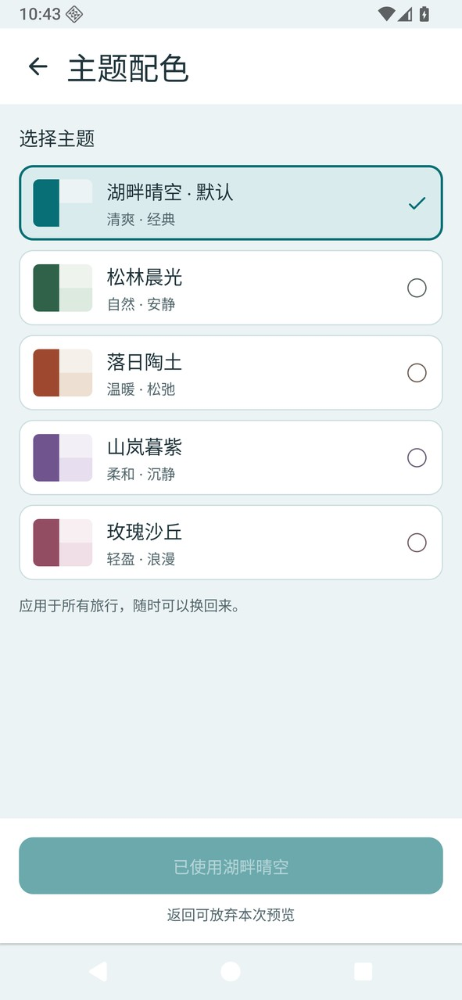</a>
  <a href="docs/images/theme-workspace-violet.jpg">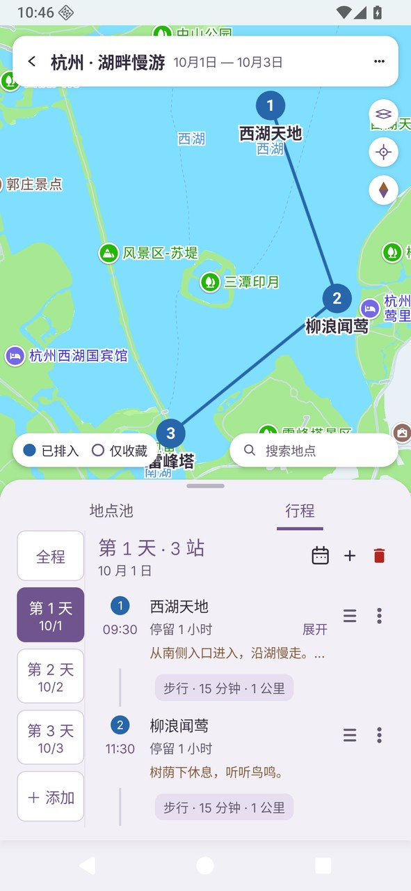</a>
</div>

**选择配色** · 直接比较五套选项。 **应用到旅行** · 首页、工作台、按钮和浮层一起换色，地图底图、日期路线色及分享长图保持原有配色。

<details>
<summary>查看五套主题在同一行程中的实际效果</summary>

<div align="center">
  <a href="docs/images/theme-workspace-lake.jpg">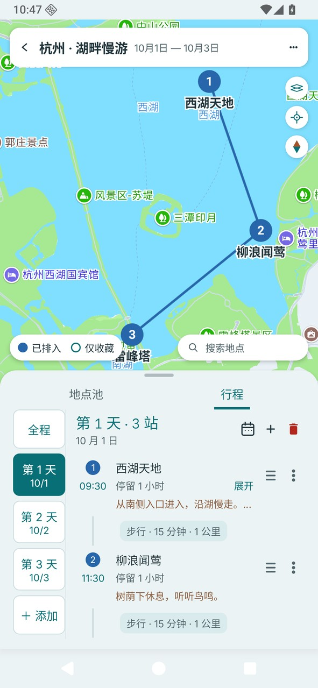</a>
  <a href="docs/images/theme-workspace-forest.jpg">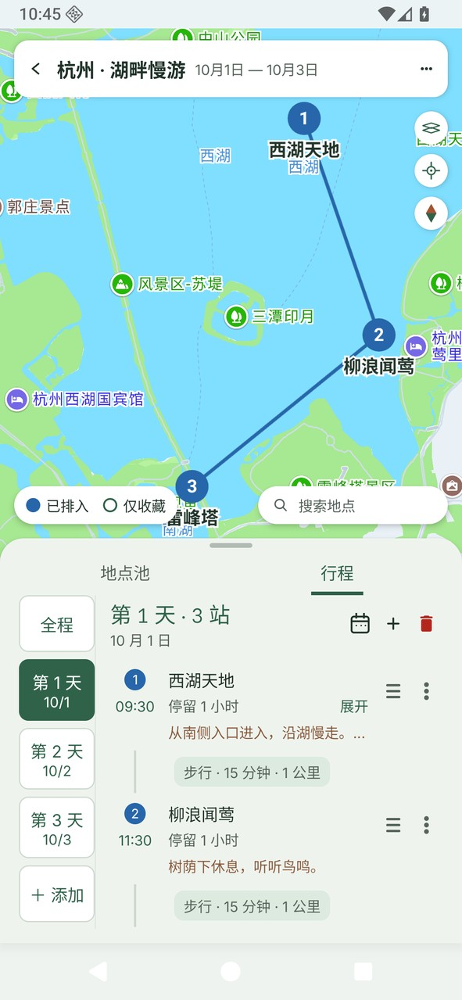</a>
  <a href="docs/images/theme-workspace-terracotta.jpg">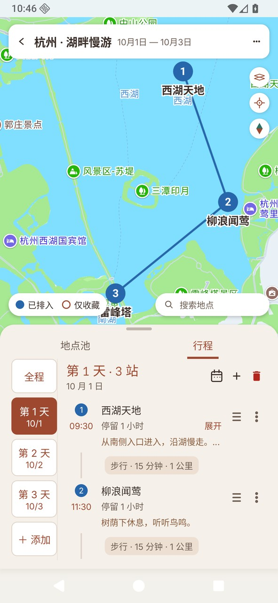</a>
  <a href="docs/images/theme-workspace-violet.jpg"></a>
  <a href="docs/images/theme-workspace-rose.jpg">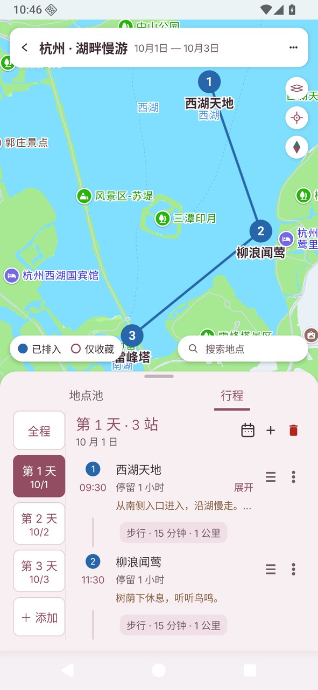</a>
</div>

顺序为湖畔晴空、松林晨光、落日陶土、山岚暮紫、玫瑰沙丘；均来自同一份示例行程的实际主题切换。

</details>

## 旅行计划，不用在清单和地图之间来回切换

先把景点、餐厅和酒店收藏起来，再按天安排。地点顺序、到达时间、停留时长和交通信息放在一起，边看地图，边调整下一站。

<div align="center">
  <a href="docs/images/my-trips.jpg"></a>
  <a href="docs/images/place-pool.jpg">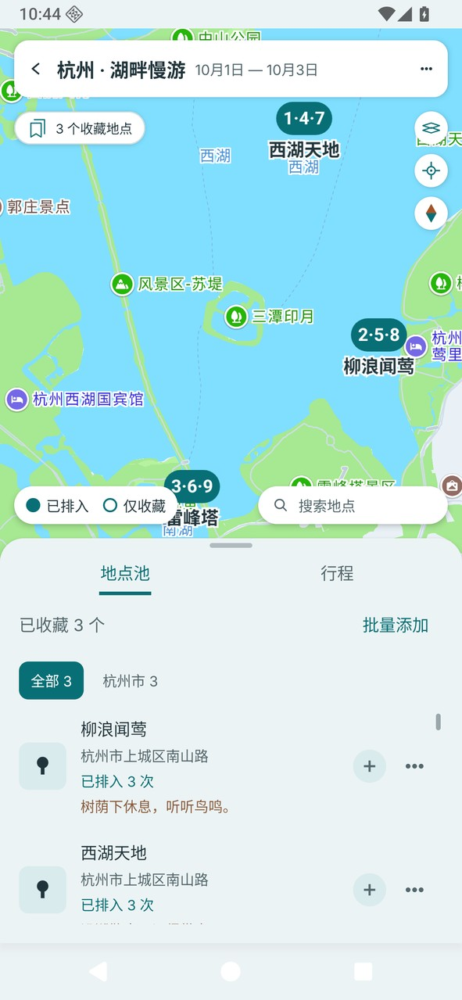</a>
  <a href="docs/images/map-itinerary.jpg"></a>
</div>

**我的旅行** · 管理下一次出发，也保留已经走过的旅程。

**地点池** · 先收藏想去的地方，按城市整理，再加入每天的行程。

**地图行程工作台** · 上方看地图，下方排日程，序号对应每个地点。

*全部截图来自 v1.6.0 正式包在专用模拟器中的同一次采集：首页为杭州、苏州，其余为同一份杭州三天示例行程。除主题对比外均使用默认湖畔晴空。地图为真实高德底图，地点坐标、路线连线和交通时长为示例数据。版本与采集方式见[图片来源](docs/images/README.md)。*

### 用行程日历，看清每天的节奏

几点出发、在哪停留、两站之间留了多少时间，在时间轴上一眼就能看清。**单日视图**可长按移动地点、拖动上下沿调整开始或结束时间；**全程视图**把不同日期并排展示，方便比较每天的安排，并可翻页查看后续日期。

<div align="center">
  <a href="docs/images/itinerary-calendar-day.jpg">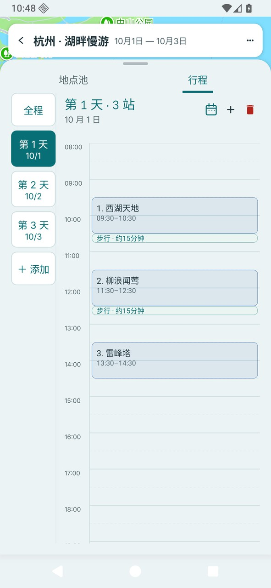</a>
  <a href="docs/images/itinerary-calendar-whole.jpg">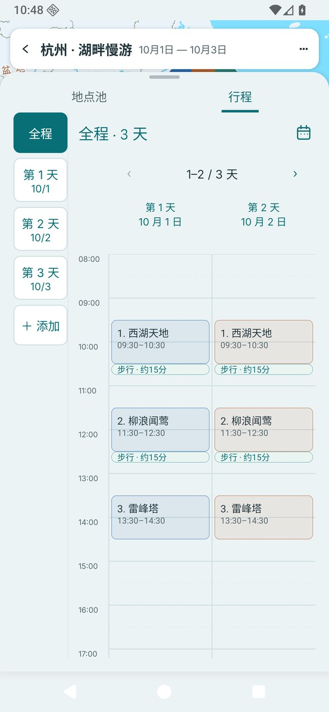</a>
</div>

**单日时间轴** · 调整当天安排。 **全程日历** · 并排比较每天的节奏。

*v1.6.0 实际运行截图，使用示例行程；全程日历为只读视图。*

### 把完整行程，变成一张可以分享的长图

从「⋯ → 分享行程长图」进入预览，选择**全程或单日**，按需保留备注，再保存图片或调用系统分享。长图按天展示路线地图、地点、到达时间、停留时长、交通和备注，同行的人打开一张图就能查看安排。

<div align="center">
  <a href="docs/images/share-preview.jpg">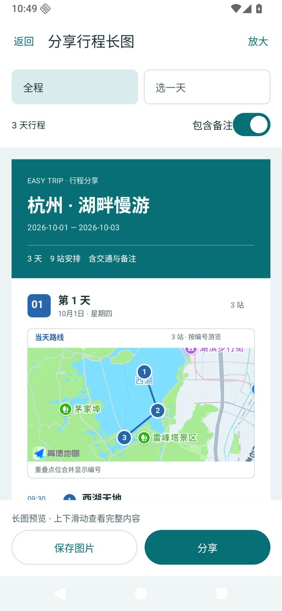</a>
  <a href="docs/images/share-long-image.png">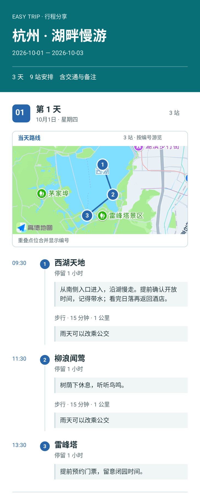</a>
</div>

**分享预览** · 先确认内容，再保存或分享。 **长图效果** · 右图展示摘要与第 1 天，[点击查看完整三天长图](docs/images/share-long-image.png)。

*v1.6.0 正式包实际生成的长图，使用真实高德底图及示例行程；路线连线和交通时长为示例数据。完整 PNG 保留全部三天内容。*

<a id="features"></a>

## 能帮你做什么

| 规划时的小麻烦 | Easy Trip 的做法 |
| --- | --- |
| 想让旅行界面换一种喜欢的颜色 | 五套浅色主题可预览后应用，所有旅行统一生效，重启保留选择；返回可放弃预览。 |
| 想去的地方很多，还没决定哪天去 | 搜索并收藏到地点池，按城市整理；加入行程时筛选已排入、未排入的地点，支持批量选择。 |
| 看了清单，还是不知道地点在哪 | 地图与行程同屏，地点名称和序号对应；按日期区分颜色，可切换单日或全程。 |
| 临时想换顺序，或给某一站多留点时间 | 拖动调整地点顺序，移到其他日期；紧凑滚轮支持上午／下午快捷切换，以半小时选择到达时间、以小时设置停留时长。 |
| 想直观看出每天几点有安排、哪里时间紧张 | 日历按时间展示单日与全程；单日可长按移动地点、拖动上下沿调整起止时间，交通与地点同列显示。 |
| 想把完整计划发给同行的人 | 生成包含旅行摘要、每日路线地图、地点、交通与备注的长图；支持全程或单日、备注开关，可保存相册或系统分享。 |
| 不确定两站之间怎么走、要多久 | 高德提供路线信息，显示距离与预计耗时，支持步行、打车、驾车和公交方式。 |
| 旅行日期过了，却不代表真的去过 | 待出行与已出行由你手动标记；多趟旅行分别管理。 |
| 旅途中没网络，也想查看计划 | 已保存的旅行、地点和行程可离线查看、编辑；地图、搜索与新路线计算需要网络。 |

### 重要的备注，抬眼就能看见

门票预约、入园提醒、酒店入住安排，都可以留在对应地点旁。行程与地点池用暖棕色区分备注，默认显示一行，长内容可原位展开、收起。行程中的切换入口放在停留时长右侧，备注展开前后保持同宽；地点池的入口与备注同行，都不额外增加按钮行。全程合并连续重复地点时，也会保留各次到访的备注。

<a href="docs/images/itinerary-note.jpg"></a>

*工作台中展开备注后的完整行程条目截图。*

### 到达几点、停留多久，顺手调好

编辑地点时，用上午／下午切换和滚轮设置到达时间、停留时长，也可以一起填写备注。同一地点想再去一次，直接再次安排即可。

<a href="docs/images/itinerary-time-edit.jpg">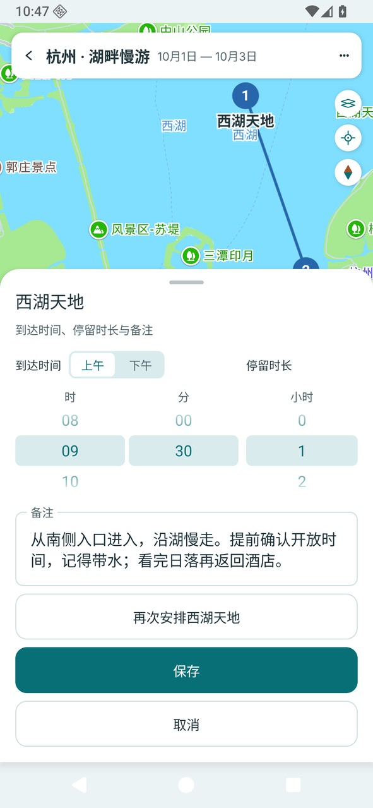</a>

*工作台中打开时间编辑面板的完整运行截图。*

## 三步，安排一次出发

1. **创建旅行**：起个名字，设置日期或天数，选择灵活出行或自驾。
2. **收藏地点**：搜索想去的景点、餐厅、酒店，放进地点池，按城市整理。
3. **排入每天**：选中地点加入行程，调整顺序、时间和交通方式，在地图上检查安排。

路线规划提供地点之间的交通参考，行程顺序由你决定。若使用中遇到问题，欢迎[提交反馈](https://github.com/chengweiv5/easy-trip/issues)。

<a id="development"></a>

## 开发与构建

使用 Kotlin、Jetpack Compose、Room 和高德地图 Android SDK。

### 开发环境

- Android Studio（支持 Android Gradle Plugin 8.9）
- JDK 17
- Android SDK 36 / Build Tools 36.0.0
- 最低系统版本 Android 8.0（API 26）

### 高德地图配置

在项目根目录未跟踪的 `local.properties` 中配置 Android SDK 路径和高德 Key：

```properties
sdk.dir=/path/to/Android/sdk
AMAP_API_KEY=your-amap-android-key
```

高德控制台中的包名必须为 `com.yangchengwei.easytrip`，并应登记对应 debug/release 签名 SHA1。不要提交 `local.properties`、keystore 或密码。

### 构建与测试

```bash
./gradlew test lint assembleDebug
./gradlew connectedDebugAndroidTest
```

安装调试包：

```bash
adb install -r app/build/outputs/apk/debug/app-debug.apk
```

物理真机发布验收参见 [`docs/testing/v1-device-checklist.md`](docs/testing/v1-device-checklist.md) 和 [`docs/testing/v2-device-checklist.md`](docs/testing/v2-device-checklist.md)。

### 正式版本构建

正式 APK 与 SHA256 校验文件发布在 [GitHub Releases](https://github.com/chengweiv5/easy-trip/releases)。

构建前，在不受版本控制的 `release-signing.properties` 中配置：

```properties
RELEASE_STORE_FILE=/private/path/easy-trip-release.jks
RELEASE_STORE_PASSWORD=your-private-password
RELEASE_KEY_ALIAS=easy-trip
# 私钥密码与密钥库不同才需要填写
# RELEASE_KEY_PASSWORD=your-private-key-password
```

也可以通过同名环境变量注入配置；环境变量优先。限制该文件的本机读取权限并在仓库外备份签名材料，后续版本沿用同一证书。`local.properties` 中的高德 Key 必须已登记正式签名 SHA1。

```bash
./gradlew :app:assembleRelease :app:testReleaseUnitTest :app:lintRelease
apksigner verify --verbose --print-certs app/build/outputs/apk/release/app-release.apk
```

从已提交且工作区干净的代码构建发布包，并检查 APK 内版本、`debuggable=false`、`GIT_SHA` 和 `SOURCE_STATE=CLEAN`。签名或高德配置缺失时 Release 构建会失败。上传后重新下载 APK 并校验 SHA256。

正式包与 Debug 包签名不同，不能直接覆盖安装；应用数据只保存在本机且尚无导出功能，卸载会丢失旅行数据。已安装 Debug 包的设备请保留原安装，先在其他设备体验正式包。后续正式版可以使用同一签名升级。

## 工作台交互

- 首页调色盘与工作台「更多 → 主题配色」共用主题页；五套浅色主题支持预览、应用保存和返回放弃，切换时保留当前工作台状态。
- 抽屉分为“地点池 / 行程”两区，搜索入口位于地图底部，搜索结果可直接聚焦地图。
- 地点池按城市组织，筛选结果与地图联动；加入行程时可搜索并筛选已排入、未排入的地点。
- 行程支持单日与全程视图，地图同步显示对应日期的地点与路线；全程会合并连续重复地点。
- 在行程标题旁点击日历图标进入时间日历，抽屉自动展开；支持全天上下滚动和顶部日期翻页。单日日历可拖动调时，待安排地点可拖入时间轴；全程日历保持只读。
- 地点调时统一长按 500 毫秒后开始，时间变化同步地点顺序与相邻交通；浮动提示避开手指并适配大字体。日历交通仅在至少 30 分钟且能完整容纳文字的空隙显示；隐藏交通时，地点内的“交通可能来不及”提示同步隐藏，真实日程重叠仍会提示。
- 行程长图支持多日完整导出与放大预览；地图不可用时保留行程清单并显示提示。
- 支持标准、卫星两种地图图层，图层选择保存在本机；提供定位与指北针。
- 地图支持手势缩放，切换抽屉高度不会重置手动视角；可按需要扩大地图或行程的可见区域。

## 行程长图分享（v1.4.0）

在旅行工作台的「⋯ → 分享行程长图」中，可预览全程或选择一天，按需隐藏备注，保存图片到相册，或交给 Android 系统分享面板。

长图按旅行摘要、每日路线地图、地点、交通与备注依次展示。分享图不包含日历，工作台时间日历保持原样。多日全程保持一张完整 PNG，按内容延展，不再因为设备整图像素预算要求改选单日。

随后每一天都先展示当天地图，再展示地点、时间、停留、交通与备注。地图编号对应清单；未计算路段以虚线标明到访顺序。地图暂不可用时保留行程清单，可重新生成；内容超出图片容量时提示改用单日，不截断文字。

## 数据与隐私

- 旅行、地点、行程及路线缓存只保存在本机 Room 数据库。
- 地图、POI 搜索和路线规划仅在用户同意高德隐私政策后启用。
- 未授权或离线时仍可查看和编辑已保存的本地旅行内容。

## 暂未支持

- 账号、云同步和多设备恢复
- 多人协作
- 自定义地图落点
- 酒店、门票或餐厅预订
- 实时导航
- 费用管理
- iOS 或其他跨平台客户端
- 自动优化地点顺序
- 后台持续定位
