<div align="center">

# Easy Trip

### 把旅行安排好，也把每一笔花费记清楚

每天去哪、几点到、怎么走，放在一张行程里；这次花了多少、往年旅行花在哪，也能回头看看。

**Easy Trip · 行程规划与旅行记账**

[查看 / 下载最新正式版](https://github.com/chengweiv5/easy-trip/releases/latest) · [看看能做什么](#features) · [从源码构建](#development)

**Android 8.0+ · 六类花费 · 年月回顾 · 五套主题 · 无需账号 · 本机保存**

</div>

> 当前正式版为 **[v2.1.0](https://github.com/chengweiv5/easy-trip/releases/tag/v2.1.0)**（build17）。[下载 APK](https://github.com/chengweiv5/easy-trip/releases/download/v2.1.0/easy-trip-v2.1.0-release.apk) · [SHA256](https://github.com/chengweiv5/easy-trip/releases/download/v2.1.0/easy-trip-v2.1.0-release.apk.sha256) · [发布验证与已知限制](docs/testing/v2.1.0-release.md)。下方界面截图仍为 v2.0.0 正式包的示例数据，展示已有能力，不作为 v2.1.0 新样式截图。

## v2.1：花费和编辑地点，区块更清楚

- 花费总览、历年、年度、月份和分类统计强化卡片、标题与间距，顶部年月切换更简洁。
- 花费占比与旅行设置统一为连续圆角进度条。
- 编辑地点分为 **时间安排／本次安排花费／地点备注**；多笔费用层级更清楚，键盘弹出时保存／取消仍可操作。
- 沿用正式签名，Room schema9 不变。请覆盖升级，不卸载或清空数据；已提前安装 2.1.0/build16 的用户需手动下载 build17，应用内不提示同名构建更新。

## v2.0：旅行花费，不只看这一趟

底部新增独立的 **「花费」** 入口。不必先打开某一次旅行，就能回顾过去几年的旅行开销，再按年份、月份、类别和旅行逐层查看。

<div align="center">
  <a href="docs/images/v2.0.0/expense-years.jpg">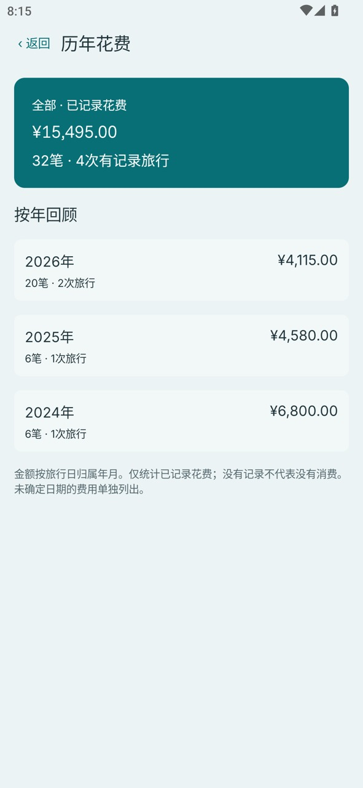</a>
  <a href="docs/images/v2.0.0/expense-year.jpg">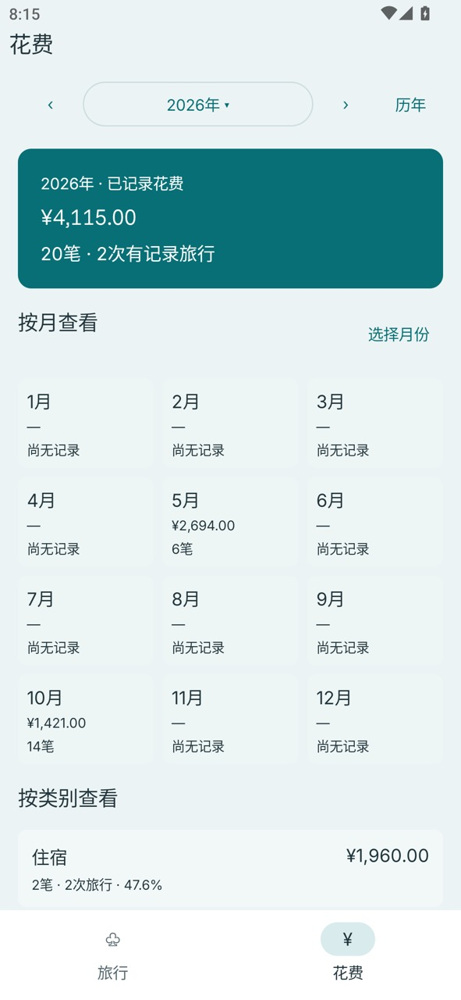</a>
  <a href="docs/images/v2.0.0/expense-categories.jpg">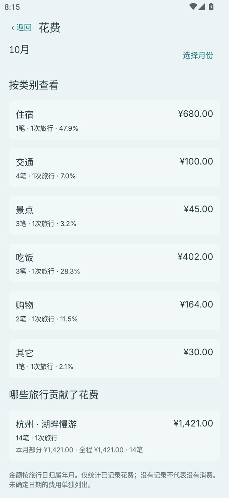</a>
</div>

**看历年** · 每年旅游花了多少。 **看月份** · 哪个月记了多少。 **看类别** · 住宿、交通、景点、吃饭、购物、其它分别占多少。

- **统计能追到每一笔**：查看具体旅行与费用明细，单笔独立编辑或删除；返回时保留浏览范围。
- **按旅行日归属年月**：不是按录入时间，也不区分预付或支付状态。尚未确定日期的费用单独列出，不硬塞进某个月。
- **改日期先看影响**：费用会跨月、跨年或进入／离开未定日期时，先展示影响，再由你确认；取消不修改。
- **只统计已记录花费**：没填不等于零消费；零元可以明确记录。

### 大多只记一笔？就在编辑地点时顺手填

不用跳到另一页。打开行程地点的「编辑」，直接填金额、选类别；到达时间、停留时长、地点备注和费用一起保存或取消。

同一地点发生多笔消费也不用拆地点。例如住在酒店，又在酒店吃早餐：分别记一笔**住宿**和一笔**吃饭**即可；同一类别也能重复记。

<div align="center">
  <a href="docs/images/v2.0.0/place-expense-inline.jpg">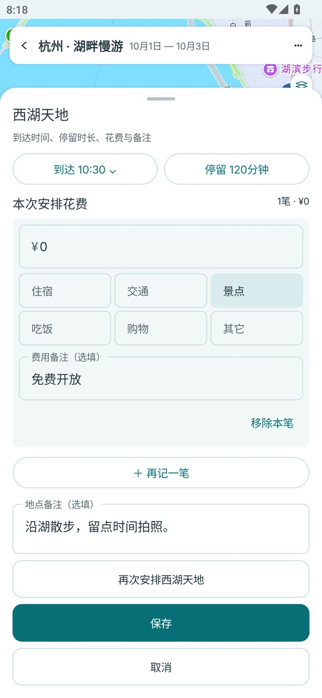</a>
  <a href="docs/images/v2.0.0/place-expenses-multiple.jpg">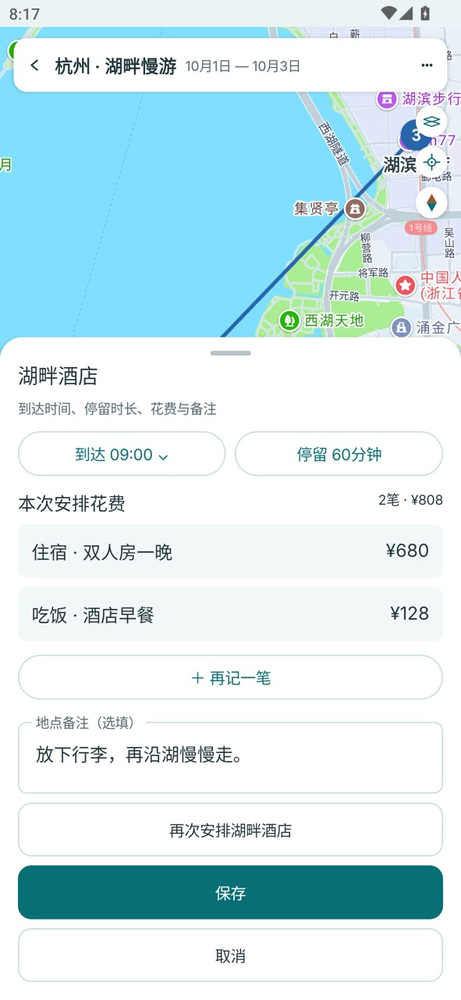</a>
</div>

**单笔直接填** · 常用操作不多一跳。 **多笔按需加** · 每笔有自己的类别和备注，移除后可在保存前撤销。

> 从旧版升级：原地点金额保留为「待分类 · 旧费用」，不会猜测成住宿或吃饭，也不会重复统计；原路段金额归为交通。再次安排同一个收藏地点不会复制上一次的费用。请使用同签名覆盖升级，**不要卸载或清空数据**；本地数据暂不支持导出或云端恢复，升级后不要直接降级旧版。

## 同一家酒店，可以是当天的第一站，也是最后一站

早上从酒店出发，晚上还要回酒店，这两段都排进行程，时间和路线才算完整。

Easy Trip 支持**同一地点重复加入行程**。酒店、餐厅、景点，想再去一次，就再排一站；每次到访都可以单独设置到达时间和停留时长。

> 酒店 → 西湖 → 餐厅 → 酒店

## 旅行计划，不用在清单和地图之间来回切换

先把景点、餐厅和酒店收藏起来，再按天安排。地点顺序、到达时间、停留时长、备注和交通信息放在一起，边看地图，边调整下一站。

<div align="center">
  <a href="docs/images/v2.0.0/my-trips.jpg">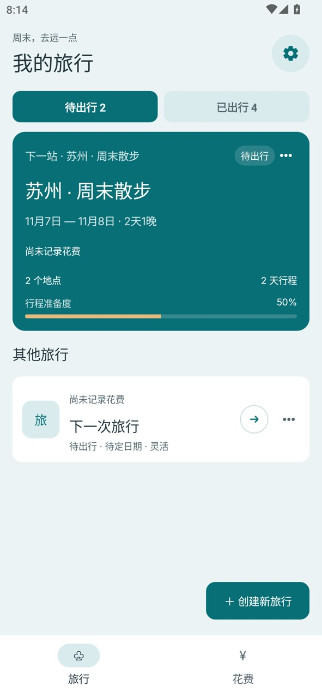</a>
  <a href="docs/images/v2.0.0/place-pool.jpg">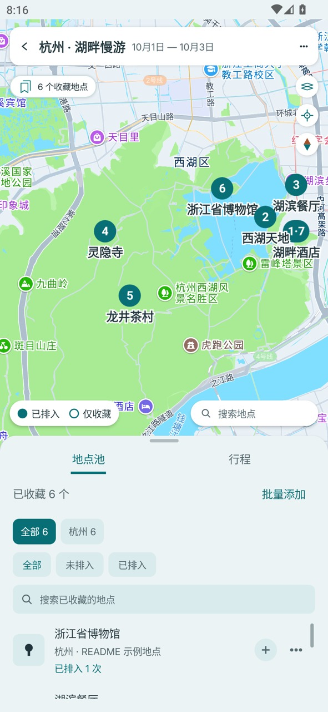</a>
  <a href="docs/images/v2.0.0/map-itinerary.jpg">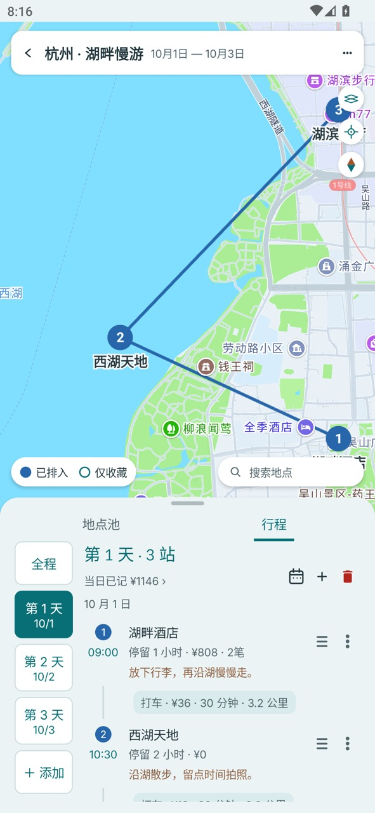</a>
</div>

**我的旅行** · 管理下一次出发，也保留已经走过的旅程。 **地点池** · 先收藏想去的地方。 **地图行程** · 上方看地图，下方排日程。

*全部截图来自 v2.0.0 正式包和独立示例旅行，不含用户手机数据。工作台为同一份杭州三天行程，除主题对比外均使用湖畔晴空。高德底图真实，示例地点、路线连线、时长和费用仅用于演示，不是出行建议或真实报价。[图片来源与处理说明](docs/images/README.md)。*

### 用行程日历，看清每天的节奏

几点出发、在哪停留、两站之间留了多少时间，在时间轴上一眼就能看清。**单日视图**可长按移动地点、拖动上下沿调整开始或结束时间；**全程视图**把不同日期并排展示，方便比较每天的安排，并可翻页查看后续日期。

<div align="center">
  <a href="docs/images/v2.0.0/itinerary-calendar-day.jpg">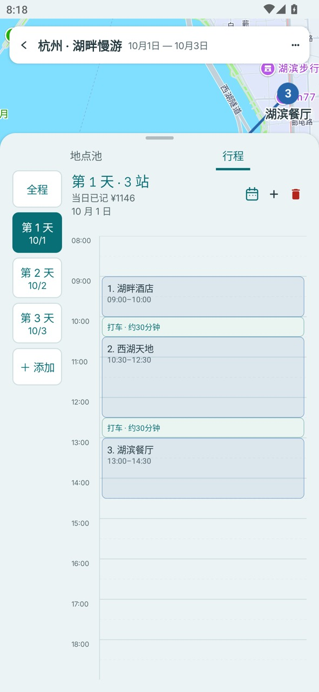</a>
  <a href="docs/images/v2.0.0/itinerary-calendar-whole.jpg">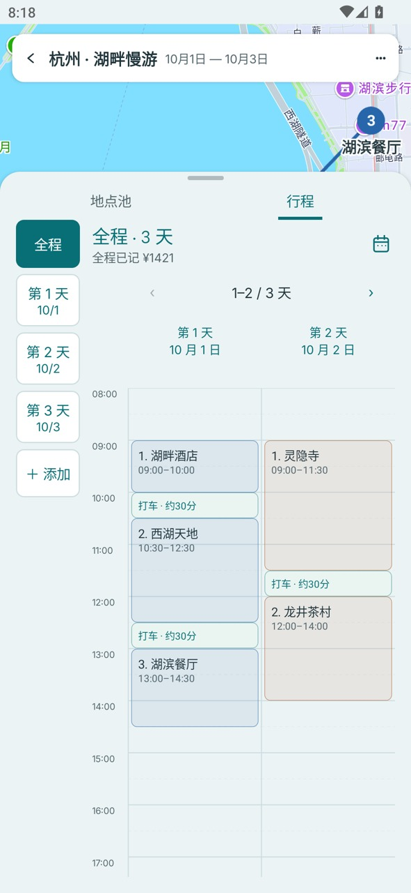</a>
</div>

**单日时间轴** · 调整当天安排。 **全程日历** · 只读对比每天的节奏。

新增、移动或排序地点后可估算时间，保留手动设置，跨越当天时明确提示。编辑地点时点击「到达」或「停留」打开时间选择器，再与备注、费用一起保存。

### 五套主题，选一个喜欢的颜色出发

清爽的**湖畔晴空**、自然的**松林晨光**、温暖的**落日陶土**、柔和的**山岚暮紫**、轻盈的**玫瑰沙丘**，五套浅色主题随时切换，默认使用湖畔晴空。

从首页右上角「设置 → 主题配色」进入。点选后直接预览整页颜色，点击「应用」即可用于所有旅行，重启后仍会记住；返回则放弃这次预览。

<div align="center">
  <a href="docs/images/v2.0.0/theme-picker.jpg">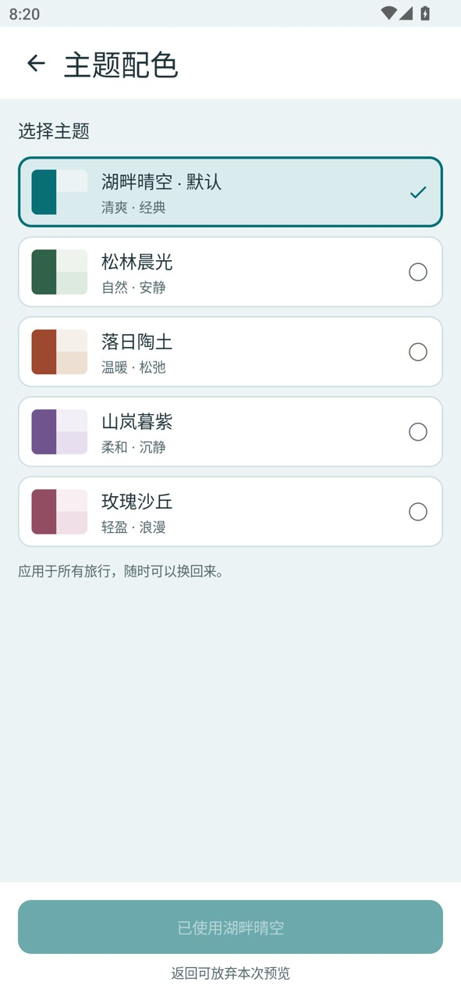</a>
  <a href="docs/images/v2.0.0/theme-workspace-violet.jpg">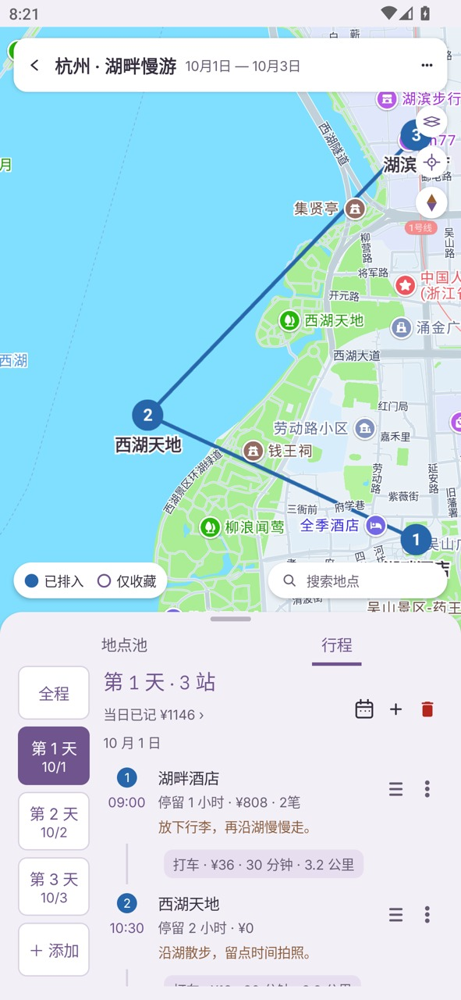</a>
</div>

### 把完整行程，变成一张可以分享的长图

从工作台「⋯ → 分享行程长图」进入预览，选择**全程或单日**，按需保留备注，再保存图片或调用系统分享。长图按天展示路线地图、地点、到达时间、停留时长、交通和备注，同行的人打开一张图就能查看安排。

<div align="center">
  <a href="docs/images/v2.0.0/share-preview.jpg">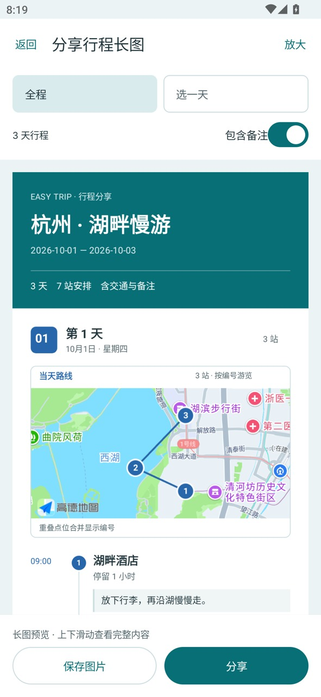</a>
  <a href="docs/images/v2.0.0/share-long-image.png">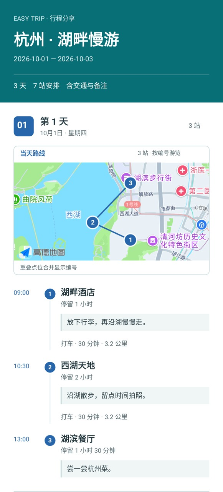</a>
</div>

**分享预览** · 先确认内容，再保存或分享。 **长图效果** · 右图展示摘要与第 1 天，[点击查看完整三天长图](docs/images/v2.0.0/share-long-image.png)。

*v2.0.0 正式包实际生成，完整 PNG 保留全部三天内容。长图用于分享行程安排，不是费用账单。*

<a id="features"></a>

## 能帮你做什么

| 旅行中的小麻烦 | Easy Trip 的做法 |
| --- | --- |
| 想回顾过去每年、每月的旅行花费 | 独立花费入口，按旅行日汇总到年、月，再查看类别和旅行明细；未定日期单独列出。 |
| 一家酒店既有住宿，又有吃饭消费 | 一个行程地点可记多笔，支持同类重复；第一笔原位填写，整页统一保存。 |
| 还没确定出发时间，也想先规划 | 创建时可不填日期和天数，先收藏或安排；空旅行日保留，可以之后补日期、加天数。 |
| 想去的地方很多，还没决定哪天去 | 搜索并收藏到地点池，按城市整理；加入行程时筛选已排入、未排入的地点，支持批量选择。 |
| 看了清单，还是不知道地点在哪 | 地图与行程同屏，地点名称和序号对应；按日期区分颜色，可切换单日或全程。 |
| 临时换顺序，或给某一站多留点时间 | 拖动排序、移动到其他日期；编辑到达时间和停留时长。 |
| 有门票预约、入住或返程提醒 | 地点旁记录备注，长内容可展开；同一地点每次到访可有不同备注。 |
| 不确定两站之间怎么走、要多久 | 高德提供距离与预计耗时，支持步行、打车、驾车和公交方式；路线仅作参考。 |
| 旅行日期过了，却不代表真的去过 | 待出行与已出行由你手动标记，多趟旅行分别管理。 |
| 旅途中没网络，也想查看计划和账目 | 已保存的旅行、地点、行程与费用可离线查看、编辑；地图、搜索和新路线计算需要网络。 |

## 三步，安排一次出发

1. **创建旅行**：起个名字，日期、天数可以先不填，选择灵活出行或自驾。
2. **收藏地点**：搜索想去的景点、餐厅、酒店，放进地点池，按城市整理。
3. **排入每天**：选中地点加入行程，调整顺序、时间和交通方式，在地图上检查安排。

旅途中，在行程地点或交通路段顺手记花费；回来后到「花费」里回顾。路线规划提供地点之间的交通参考，行程顺序由你决定。搜索支持异地门店；有有效定位时显示直线距离，选中结果后回到地图。

若使用中遇到问题，欢迎[提交反馈](https://github.com/chengweiv5/easy-trip/issues)。


<a id="development"></a>

## 开发与构建

使用 Kotlin、Jetpack Compose、Room 和高德地图 Android SDK。

### 开发环境

- Android Studio（支持 Android Gradle Plugin 8.9）
- JDK 17
- Android SDK 36 / Build Tools 36.0.0
- 最低系统版本 Android 8.0（API 26）

### 高德地图配置

在项目根目录未跟踪的 `local.properties` 中配置 Android SDK 路径和高德 Key：

```properties
sdk.dir=/path/to/Android/sdk
AMAP_API_KEY=your-amap-android-key
```

高德控制台中的包名必须为 `com.yangchengwei.easytrip`，并应登记对应 debug/release 签名 SHA1。不要提交 `local.properties`、keystore 或密码。

### 构建与测试

```bash
./gradlew test lint assembleDebug
./gradlew connectedDebugAndroidTest
```

安装调试包：

```bash
adb install -r app/build/outputs/apk/debug/app-debug.apk
```

物理真机发布验收参见 [`docs/testing/v1-device-checklist.md`](docs/testing/v1-device-checklist.md) 和 [`docs/testing/v2-device-checklist.md`](docs/testing/v2-device-checklist.md)。

### 正式版本构建

正式 APK 与 SHA256 校验文件发布在 [GitHub Releases](https://github.com/chengweiv5/easy-trip/releases)。

构建前，在不受版本控制的 `release-signing.properties` 中配置：

```properties
RELEASE_STORE_FILE=/private/path/easy-trip-release.jks
RELEASE_STORE_PASSWORD=your-private-password
RELEASE_KEY_ALIAS=easy-trip
# 私钥密码与密钥库不同才需要填写
# RELEASE_KEY_PASSWORD=your-private-key-password
```

也可以通过同名环境变量注入配置；环境变量优先。限制该文件的本机读取权限并在仓库外备份签名材料，后续版本沿用同一证书。`local.properties` 中的高德 Key 必须已登记正式签名 SHA1。

```bash
./gradlew :app:assembleRelease :app:testReleaseUnitTest :app:lintRelease
apksigner verify --verbose --print-certs app/build/outputs/apk/release/app-release.apk
```

从已提交且工作区干净的代码构建发布包，并检查 APK 内版本、`debuggable=false`、`GIT_SHA` 和 `SOURCE_STATE=CLEAN`。签名或高德配置缺失时 Release 构建会失败。上传后重新下载 APK 并校验 SHA256。

正式包与 Debug 包签名不同，不能直接覆盖安装；应用数据只保存在本机且尚无导出功能，卸载会丢失旅行数据。已安装 Debug 包的设备请保留原安装，先在其他设备体验正式包。后续正式版可以使用同一签名升级。

## 工作台交互

- 首页「设置 → 主题配色」管理全局主题；五套浅色主题支持预览、应用保存和返回放弃，工作台「更多」仅保留旅行相关操作。
- 抽屉分为“地点池 / 行程”两区，搜索入口位于地图底部，搜索结果可直接聚焦地图。
- 地点池按城市组织，筛选结果与地图联动；加入行程时可搜索并筛选已排入、未排入的地点。
- 行程支持单日与全程视图，地图同步显示对应日期的地点与路线；全程会合并连续重复地点。
- 在行程标题旁点击日历图标进入时间日历，抽屉自动展开；支持全天上下滚动和顶部日期翻页。单日日历可拖动调时，待安排地点可拖入时间轴；全程日历保持只读。
- 地点调时统一长按 500 毫秒后开始，时间变化同步地点顺序与相邻交通；浮动提示避开手指并适配大字体。日历交通仅在至少 30 分钟且能完整容纳文字的空隙显示；隐藏交通时，地点内的“交通可能来不及”提示同步隐藏，真实日程重叠仍会提示。
- 行程长图支持多日完整导出与放大预览；地图不可用时保留行程清单并显示提示。
- 支持标准、卫星两种地图图层，图层选择保存在本机；提供定位与指北针。
- 地图支持手势缩放，切换抽屉高度不会重置手动视角；可按需要扩大地图或行程的可见区域。

## 行程长图分享（v1.4.0）

在旅行工作台的「⋯ → 分享行程长图」中，可预览全程或选择一天，按需隐藏备注，保存图片到相册，或交给 Android 系统分享面板。

长图按旅行摘要、每日路线地图、地点、交通与备注依次展示。分享图不包含日历，工作台时间日历保持原样。多日全程保持一张完整 PNG，按内容延展，不再因为设备整图像素预算要求改选单日。

随后每一天都先展示当天地图，再展示地点、时间、停留、交通与备注。地图编号对应清单；未计算路段以虚线标明到访顺序。地图暂不可用时保留行程清单，可重新生成；内容超出图片容量时提示改用单日，不截断文字。

## 数据与隐私

- 旅行、地点、行程、费用及路线缓存只保存在本机 Room 数据库。
- 地图、POI 搜索和路线规划仅在用户同意高德隐私政策后启用。
- 未授权或离线时仍可查看和编辑已保存的本地旅行内容。

## 暂未支持

- 账号、云同步和多设备恢复
- 多人协作
- 自定义地图落点
- 酒店、门票或餐厅预订
- 实时导航
- 预付／支付状态、AA 分账、多币种和费用报销
- 数据导出、备份与跨设备恢复
- iOS 或其他跨平台客户端
- 自动优化地点顺序
- 后台持续定位
