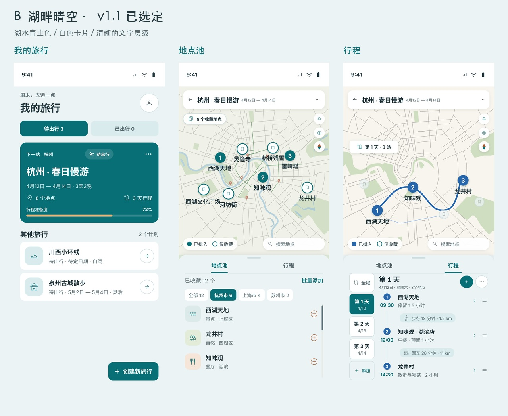

# Easy Trip v1.1 配色

已选定 **B 湖畔晴空**（2026-09-21）。

可编辑源文件：[easy-trip-v1.1-color-directions.pen](easy-trip-v1.1-color-directions.pen)。B 的首页、地点池、行程分别为 `zY61u`、`L4o6iu`、`pV2Qd`，色彩规范为 `k9ztQ`，确认标识为 `TOtFN`。A/C/D 保留用于历史对照。

| 角色 | 颜色 | 用途 |
|---|---|---|
| 主色 | #086F76 | 主按钮、选中态、地图控件 |
| 页面背景 | #ECF3F4 | 浅灰青底，分离白色卡片 |
| 卡片 | #FFFFFF | 顶栏、列表卡片、弹窗 |
| 浅色容器 | #D9EBED | 日期、筛选、轻提示 |
| 正文 | #20343B | 标题、名称、主要信息 |
| 次级文字 | #53676D | 日期、地址、交通说明 |
| 分隔描边 | #CCDDE0 | 卡片/控件边界 |
| 强调 | #A3532B | 指北针北针、搜索焦点 |
| 进度 | #E5BA80 | 深色首页卡片中的准备度 |
| 错误 | #B3261E / #FCEFED | 错误前景与背景 |

每日路线色：`#2766AA`、`#AD5C2D`、`#287A72`、`#82549B`、`#B74562`、`#667526`、`#197C92`、`#6958AE`。循环使用，保留序号和日期辅助识别；地图和行程列表共用。常态交通信息用次级文字和浅色底，错误保留内联重试与更改方式。

布局、地图底图与交互沿用现有版本。对比度检查：B 常用文本/按钮组合最低 4.81:1，日期色白字最低 4.83:1；这不等同全页面无障碍认证。

原始 design/easy-trip-v2.0.pen 保留。开发采用功能分支，运行时截图、校验与回滚见 `.scratch/v1.1-color-directions/verification.md`。

## 实现验收

B 配色已落地 Android v1.1.0（versionCode 3）。801 项单测与 44 项模拟器检查通过；1 项首页滚动固定区域断言在旧版同样失败，单独记录。构建和 lint 通过。可编辑设计已原生保存、独立磁盘副本回读，Pencil 已切回本文件。

调试 APK：`app/build/outputs/apk/debug/app-debug.apk`。本轮完成模拟器验证，未安装真机、未发布。
