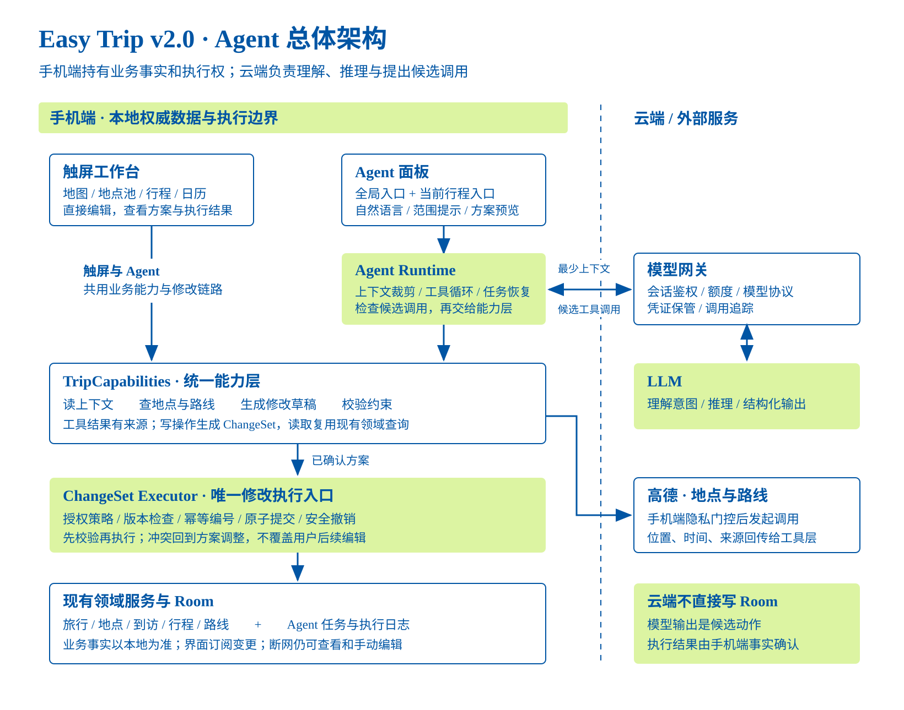
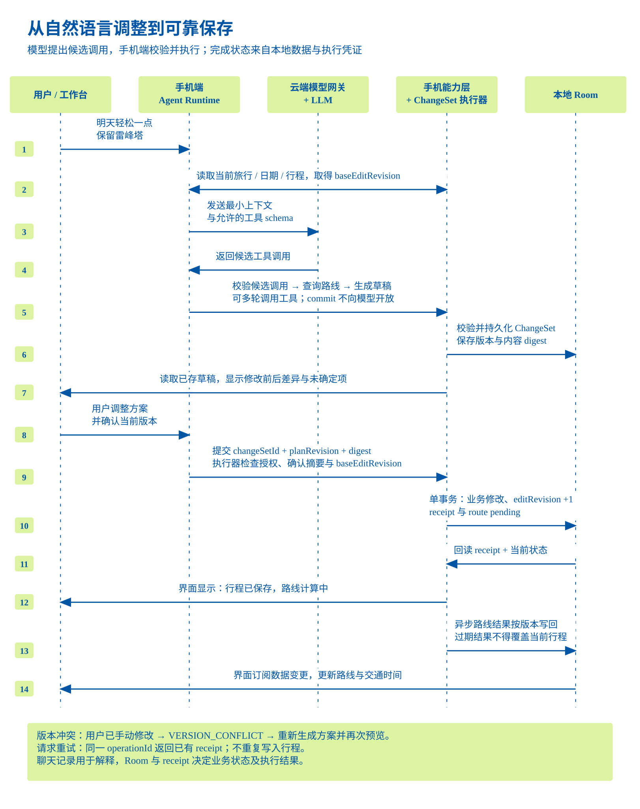
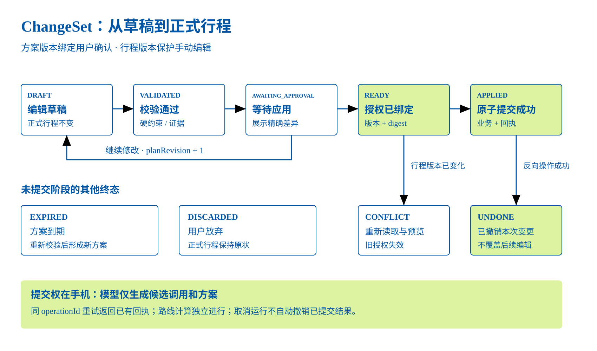

# Easy Trip v2.0 Agent 架构设计：手机端执行、云端推理

归档说明：原设计日期为 2026-09-24；2026-10-08 归档时已回读飞书第 4 版，正文及三张画板的原生节点与原交付一致。本文保留原设计的源码基线和拟议状态，不代表已按后续版本重新验证或实现。

在线文档（含可编辑画板）：[Easy Trip v2.0 Agent 架构设计：手机端执行、云端推理](https://bytedance.larkoffice.com/docx/MhG8dAiFHorRB9xPts1cLx9enuc)。下方插图使用随文归档的 SVG 源文件。

设计评审稿 · 2026-09-24 · 面向产品负责人、Android 与后端开发者。本文细化推荐方案；新增模块、接口、状态与指标均为拟议设计，尚未实现或进行模型联调。源码核对基线：781a543ddb218abf2467b79b2a7f1d4767fa6aa5。

## 推荐决策与首期目标

采用“手机端执行 + 云端推理”的内置旅行 Agent。手机保留旅行事实、任务状态和写入权；云端模型根据最小上下文提出工具调用与调整方案。地图、地点池和日历负责结果展示与精细编辑，触屏与 Agent 共享业务能力。

先完成“已有行程的自然语言调整”，再扩展一句话创建旅行与检查行程。首期一个 Agent 循环即可；多 Agent、云同步、后台主动监控与外部 Agent 协议有独立依赖，不同时铺开。

| 范围 | 推荐边界 |
| --- | --- |
| 首个闭环 | “明天轻松一点，保留雷峰塔，15:00 前回酒店” → 读取 → 查询 → 方案 → 预览/修改 → 应用 → 撤销。 |
| 首期覆盖 | 文字输入、当前旅行/日/地点上下文、已有地点编排、必要 POI 和路线查询、差异预览、授权、失败恢复。 |
| 后续复用 | 从零创建旅行、冲突检查与修复、语音输入；使用同一能力层和执行器。 |
| 另行设计 | 天气/门票实时来源、预订支付、多设备同步、自动分享、常驻后台管家与外部 MCP 接入。 |

## 现有基础与需要补齐的边界

下表“已存在”来自本次与前序源码阅读，本次未重跑应用测试。仓库旧文件名中的 v2 是过去的 UI 迭代语境，不表示本文 Agent 能力已存在。

| 已核实基础 | 可复用 | 需要新增 |
| --- | --- | --- |
| Kotlin / Compose / Room；数据库版本 6 | 现有业务实体、地图/清单/日历与离线编辑 | Run、ChangeSet、CommitReceipt、旅行 editRevision；采用下一可用数据库版本迁移。 |
| TripService、ItineraryRepository、SavedPlaceRepository | 业务规则和存储 | 共享能力入口；部分 ViewModel 仍直接调 repository，不能只在 Agent 侧校验。 |
| addItemIdempotently 与唯一索引 | 单项添加去重 | 操作级幂等回执及参数摘要校验。 |
| compareAndSetTiming 与顺序快照 | 局部时间编辑并发检查及反向操作 | 旅行级版本 + 整份 ChangeSet 原子提交。 |
| AddPlacesToDayUseCase 返回 PartialSuccess | 允许逐项完成的添加流程 | 整天重排使用独立批量事务，不能把循环调用当作原子事务。 |
| RouteRefreshCoordinator 与 leg.version | 路线异步计算、过期回调拒绝、断网恢复 | 草稿查询与正式路线缓存隔离，提交后产生待计算路段。 |
| 高德隐私门控 | 未同意不创建高德搜索/路线对象 | Agent 同样经过门控；向云模型发送数据另行说明与征得同意。 |

## 总体架构与部署边界

主线：用户意图进入手机 Runtime；Runtime 读取上下文、请求模型、验证候选工具调用；查询和草稿进入 TripCapabilities；用户确认后，受信任的应用代码调用 ChangeSet Executor；执行器通过领域规则与 Room 提交。云端模型没有数据库连接或本地提交授权。

| 模块 / 建议包边界 | 职责与依赖 | 约束 |
| --- | --- | --- |
| agent/ui | 面板、作用范围、进度、方案卡；依赖工作台状态和 RunState | 以结构化状态显示完成情况，不能靠助手文本判断已保存。 |
| agent/runtime | ContextAssembler、单循环 Orchestrator、ToolDispatcher、恢复检查；依赖 ModelPort 与能力端口 | 一个旅行同时最多一个 Agent 写任务；并存草稿仍需提交版本校验。 |
| application/capabilities | 读取、查询、创建/修改草稿、校验；复用现有 domain 接口 | 类型化输入输出、稳定 ID、结构化错误；不暴露 SQL 或任意执行。 |
| application/changeset | 策略授权、方案编译、并发校验、事务提交、回执、撤销 | 只有受信任的本地代码能提交；模型不能签发 approvalToken。 |
| agent/data + Room | Run、ToolCallJournal、ChangeSet、CommitReceipt 与业务数据 | 草稿与正式表分离；回执与业务修改同事务落库。 |
| 独立模型网关 | 客户端认证、额度、协议适配、流式转发、请求关联 | 首期一个服务即可；不存储正式旅行副本，不接管写入。 |
| LLM Provider | 理解约束、选择工具、解释方案 | 只接收任务需要的上下文；事实来自工具。 |
| 手机 Amap 适配器 | POI 与路线查询，遵守已接受 ADR | 迁到云端 HTTP API 需另行评估；不能直接复用 Android SDK Key。 |

先用包边界实现，不立即拆分大量 Gradle 模块和微服务。保留 ModelPort、ToolPort、ChangeSetStore 等窄接口，便于替换模型和离线测试。外部 Agent 是未来入口，复用相同业务语义。

## 用户体验与上下文契约

两个入口：首页“帮我规划旅行”和工作台“调整行程”。工作台入口默认绑定当前旅行、日期及选中的行程项，顶部显示可修改的作用范围，例如“杭州三日游 · 第 2 天 · 雷峰塔”。首期文字输入，语音转写之后复用相同链路。

| 上下文 | 规则 |
| --- | --- |
| 旅行 / 日期 | tripId、dayId、起始日、目的地时区与当前日期。旅行没设置实际日期时，不能把“明天”擅自等同 Day 2，须澄清。 |
| 选中对象 | itineraryItemId 表示一次到访，savedPlaceId 表示收藏地点；同地点可多次到访，不能仅按名称移动或删除。 |
| 用户约束 | 必须保留/固定时间为硬约束；轻松、少走路为软偏好。酒店/出发点/目标日期不确定时问关键问题。 |
| 事实与建议 | 区分用户输入、App 事实、工具结果、模型建议；保留来源、查询时间和缺失字段。 |
| 上下文大小 | 首轮只取目标日、相关收藏和必要相邻行程，缺信息再查；不上传全库。 |

对象明确、可撤销的单点命令可由本地策略允许直接执行，如修改当前项停留时长；多个地点/日期的调整默认先预览。用户继续说“午饭别动”或拖动草稿卡片，都产生新的 planRevision，正式行程保持原状。

方案卡展示新增/移动/移除与时间变化、硬约束结果、路线证据和待核实事项；按钮为“应用方案”“继续调整”“放弃”。过程只显示真实阶段，例如“正在查询两段交通”，不展示内部思维链。

## 一次调整的完整时序

先持久化 runId，读取一致的旅行快照和 editRevision；Runtime 发送受限工具列表与最小上下文。手机对模型候选调用校验名称、参数、范围和授权，再执行查询或草稿修改，将结构化结果记入调用日志并反馈模型，直到可预览或存在明确阻塞。

应用由工作台提交 changeSetId、planRevision、内容摘要和本地授权证明。执行器再次校验旅行归属、方案版本、硬约束与证据，在 Room 单事务中写业务变化、递增 editRevision、保存 CommitReceipt 和待计算路段。UI 回读数据库与回执后才显示“行程已保存”。

路线刷新独立进行；断网、无路线或缓存过期必须显示。路线尚未验证时，不能宣称“全部安排均能按时完成”。若预览期间用户改了正式行程，提交返回 VERSION_CONFLICT，重新读取并生成新方案，再次预览。

## TripCapabilities 与工具契约

以下接口名称为拟议契约，尚未实现。模型仅获得 read / search / draft / validate 工具；commit、undo、对外分享由应用授权控制器调用。未来外部 Agent 同样遵守此分工。

| 能力组 | 拟议操作 | 返回与副作用 |
| --- | --- | --- |
| 读取 | get_trip_context / get_day_itinerary / list_saved_places | 稳定 ID、editRevision、事实快照；纯读取。 |
| 查询 | search_places / estimate_routes | POI/路线、source、fetchedAt、状态；不自动收藏。 |
| 草稿 | create_draft / patch_draft | changeSetId、planRevision、digest、差异；只写草稿区。 |
| 校验 | validate_draft | 硬错误、软警告、证据缺口、影响；不改正式行程。 |
| 提交：受信入口 | commit_changeset | 授权、版本、幂等校验；返回持久化 receipt。 |
| 恢复 / 撤销：受信入口 | get_operation_status / undo_commit | 查回执；通过带前置条件的反向变更撤销。 |

| 契约 | 规则 |
| --- | --- |
| ToolRequest | schemaVersion、runId、callId、scope、arguments；身份来自本地会话，不能由模型自报。 |
| Scope | 首期单一 tripId 写入；所有 dayId / itemId 引用须校验归属。 |
| ToolResult | callId、status、typedData、errorKind、retryable、evidence；助手文案解释结果，不决定结果。 |
| 草稿动作 | AddOccurrence / MoveOccurrence / UpdateTiming / UpdateNote；新增项使用 tempId，回执映射真实 ID。 |
| 流式输出 | 完整接收并通过 schema 校验才执行；增量 JSON 不触发工具，未知工具/多余字段拒绝。 |

模型提出候选顺序与时间，程序计算重叠、交通余量、归属和固定项约束。地点存在性依赖 POI ID 与查询证据；没有来源的开放时间、天气和票务信息必须标未知。“最优路线”不是首期承诺。

草稿写操作与 ToolCallJournal 的成功记录必须在同一 Room 事务内提交，并对 (runId, callId) 建唯一约束，事务内还需校验 expectedPlanRevision。相同编号与参数返回已有结果；相同编号参数不同拒绝。外部只读查询可重试，但结果写入需校验 Run 状态与参数摘要，不能恢复后重复追加草稿动作。

## ChangeSet、回执与生命周期

| 对象 | 主要字段 | 用途 |
| --- | --- | --- |
| AgentRun | runId、tripId、scope、status、checkpoint、lastEventSeq、budget、expiresAt | 恢复进度；状态独立于聊天。 |
| ToolCallJournal | runId/callId、toolName、argsDigest、status、resultDigest、resultRef | 调用去重与恢复；同编号不能换参数。 |
| ChangeSet | changeSetId、tripId、baseEditRevision、planRevision、schemaVersion、operations、constraints、evidenceRefs、digest、status | 可复现的方案与基础版本。 |
| Approval | changeSetId、planRevision、digest、policyVersion、actor、expiresAt | 绑定精确方案；由手机签发，方案变化即失效。 |
| CommitReceipt | operationId、argsDigest、changeSetId、fromRevision、toRevision、appliedIds、inverseRef、routeStatus | 与业务修改同事务写入，证明是否已提交。 |
| Trip.editRevision | 旅行级单调递增版本 | 所有正式用户编辑都递增；路线结果用 leg.version，不无故使草稿失效。 |

ChangeSet 主流程：DRAFT → VALIDATED → AWAITING_APPROVAL → READY → APPLIED。修改草稿增加 planRevision 并回到 DRAFT；正式行程改变进入 CONFLICT；到期或放弃进入 EXPIRED / DISCARDED；校验失败保留 DRAFT 并返回错误；授权到期退回等待确认；APPLIED 后经反向操作到 UNDONE。简单直接指令可由本地策略签发 READY，但不跳过校验。

AgentRun 另有 RUNNING、WAITING_INPUT、WAITING_APPROVAL、PAUSED_NETWORK、PAUSED_BACKGROUND、COMPLETED、FAILED、CANCELLED。一个运行可产生多个草稿；取消运行或关闭面板均不自动撤销已提交的业务。

### 原子提交与并发

- 准备：网络查询、模型调用和方案编译均在事务外，只生成草稿和证据。
- 事务入口：先按 operationId 查回执；同参数返回原结果，同编号异参拒绝。再校验 planRevision、digest、授权有效期、editRevision、归属和本地业务约束。
- 原子范围：业务修改、顺序、相邻路线失效/待计算、editRevision 递增、ChangeSet=APPLIED 和 receipt 一起提交；失败全部回滚。
- 恢复：若事务已提交而 UI 未收到结果，凭 operationId 查 receipt；不能换一个编号重做。
- 边界：不承诺跨网络恰好执行一次；使用唯一索引和回执避免重复业务副作用。回执过保留期后拒绝旧操作自动重放，重新读取并由用户发起新操作。

硬约束由受信任的应用流程从用户明确表达/确认形成 ConstraintSet，记录来源消息、规范化对象与时间、constraintVersion；歧义先澄清，预览显式列出。模型只能提出修改建议，不能自行删除或降低硬约束。方案摘要应覆盖操作、约束版本、证据引用与用户接受的例外。用户更改硬约束或接受缺口，形成新版本并重新校验、确认。

路线证据需包含端点/顺序/交通方式摘要、来源、查询时间和有效性规则；提交前检查其与当前方案匹配。需要依赖路线才能满足的硬时间约束，在无有效证据时不能标通过；用户可明确放宽约束或接受待核实状态，但必须生成新方案并确认。精确时效规则与供应商策略在原型阶段验证。

### 撤销与授权

撤销使用新的 operationId 生成反向 ChangeSet，沿用相同执行器、版本校验、原子提交与回执去重；反向提交与原 ChangeSet=UNDONE 在同一事务中落库，重复撤销返回已有回执。反向变更只触及本次操作。首期采用保守策略：当前 editRevision 必须等于被撤销操作的 toRevision；其后有编辑则不直接撤销，提供新的恢复方案预览。不能整库恢复来撤销一次 Agent 修改。

查询在已同意范围内直接执行；草稿不影响正式数据；复杂正式写入需用户应用。删除整趟旅行、分享及未来预订独立确认。方案修改后原授权失效。网页、地点介绍或备注里的文字不能提升权限。

## 失败、后台与数据边界

| 情况 | 系统处理 | 用户结果 |
| --- | --- | --- |
| 网络断开 / 模型超时 | 保存 checkpoint；恢复需继续任务。草稿工具去重，模型请求可能重复计费，不承诺零重复成本。 | 网络中断，草稿已保留。 |
| 进程被杀 | 重启查询 Run / ChangeSet / receipt；区分未提交和已提交。 | 恢复到真实阶段，避免重复添加。 |
| 切后台 | 首期前台执行，系统限制时保存并暂停；WorkManager 只做适合延后执行的重试。 | 已暂停，回到应用继续；不承诺常驻即时执行。 |
| 取消 | 不再启动新工具；若本地事务已提交，保留回执并提供撤销。 | 明确“未保存”或“已保存，可撤销”。 |
| VERSION_CONFLICT | 旧授权失效，重新读正式数据并生成方案。 | 请查看更新后的方案。 |
| 无路线 / 证据过期 | 返回结构化缺口，不能进入“已验证可行”；必要条件缺失需补充或清楚接受估算。 | 标明待核实，不造交通时长。 |
| 无效参数 / 越权 | 手机拒绝调用并返回可纠正错误；不做危险试探。 | 明确未执行及原因。 |
| 预算用尽 / 循环无进展 | 设置可配置时限、工具次数、token 预算；重复无进展调用触发停止。 | 保留草稿，询问是否继续。 |

每个旅行独立隔离。首期不自动建立跨旅行长期记忆；明确保存的偏好后续独立建模，提供查看、更正和删除入口。

云端网关保存模型服务凭证。若首期不做账号，可采用安装实例注册 + 短期令牌 + 服务端额度/速率控制，设备凭证存 Keystore。安装身份不等同真实用户身份，也不提供云同步；公开发行前评估滥用控制，跨设备功能需账户和设备授权。

云助手首次启用说明发送的用户输入、当前旅行片段和必要工具结果。高德门控独立保留；精确实时定位仅任务需要且用户允许时使用。网关默认不记录完整提示词和旅行正文；诊断记录关联 ID、错误、耗时和用量。完整诊断若启用，需明确保留时限与删除方式。

工具返回的网页、POI 介绍和备注都是待处理数据；即使包含“忽略此前规则”，也不能改变工具白名单、系统规则与授权范围。

## 迁移、验证与回滚

| 阶段 | 交付 | 验收 |
| --- | --- | --- |
| A：执行基础 | 共享写入口、editRevision、ChangeSet、回执、撤销；确定性假模型 | UI/Agent 一致；故障注入下无部分重排、重复副作用或丢失编辑。 |
| B：首个闭环 | 面板、网关、真实模型；已有行程调整 | 需求 → 工具 → 草稿 → 预览 → 应用；每项变化可定位、可修正。 |
| C：扩展灰度 | 创建旅行、检查修复、恢复、成本/延迟观测 | 三场景端到端回归；迁移、弱网与真实 Android 设备验证。 |
| 后续入口 | 语音与外部 Agent 共用能力层 | 外部接入另行完成配对、认证、在线通道、授权与结果查询。 |

MCP 是协议适配层，不是设备连接方案。数据在手机 Room，远程 Agent 还需要设备在线、配对授权和可达通道；后台或离线应返回等待/不可用，不能把加 MCP server 等同于远程控制已实现。

| 验证类别 | 必须覆盖 |
| --- | --- |
| 并发 | 预览后拖动正式行程则拒绝旧方案；两份草稿顺序提交检测冲突；路线刷新不误伤 editRevision。 |
| 幂等 / 崩溃 | 同 operationId 重试只发生一次业务副作用；同编号异参拒绝；事务前/中/后杀进程恢复；覆盖草稿写入与日志之间、撤销写入与 UNDONE 标记之间的故障窗口。 |
| 业务 | 重复到访按 itemId 区分；跨日移动、固定项、零/未知时长、无实际日期与时区语义。 |
| 授权 / 事实 | 修改草稿使授权失效；模型不能 commit；备注指令不能越权；无来源不伪造事实。 |
| 交互 / 持久化 | 预览不污染正式表；提交后地图/清单/日历一致；撤销不覆盖后来编辑。 |
| 设备 / 网络 | 模拟器测试之外，真实设备验证前后台、进程回收、弱网、高德授权撤回。 |

发布阻断项：硬约束违规写入、重复副作用、覆盖未确认的手动修改、越权调用。观测完成率、方案接受/修改率、冲突率、撤销率、工具错误率、耗时和单任务用量。先建立实测基线再定性能/成本阈值，不把未测试的延迟与成功率作为保证。

数据库增量迁移，不删除旅行表。助手入口、云端调用与写工具分别可开关；异常先关闭 Agent 写入口，保留触屏与数据。新 schema 上回滚优先向前兼容修复包，不能直接降级旧 APK 或卸载重装。发布前用测试数据库验证迁移与恢复。

## 关键取舍与待验证事项

| 决策 | 备选与代价 | 建议 |
| --- | --- | --- |
| 手机 Runtime + 云模型 | 全云编排需同步与设备通道；纯端侧模型受资源约束 | 首期手机 Runtime，通过 ModelPort 替换供应商。 |
| 类型化工具 | 屏幕点击受 UI/前后台影响；直接写数据库绕过规则 | 业务工具 + 受信执行器。 |
| 旅行级版本 | 字段级合并灵活但时间/顺序/路线冲突更复杂 | 首期拒绝过期方案，后续再做细粒度合并。 |
| 单 Agent 循环 | 多 Agent 增加延迟、预算、协调状态 | 单循环有预算；独立查询可并行，修改和提交串行。 |
| 模型供应商 | 中文理解、工具调用、协议、延迟、成本、数据保留未实测 | 统一场景集验证准确 API 路径与工具协议后选择。 |
| 实时事实 | 天气/门票/开放时间未形成可靠数据链 | 先标未知；产品必须承诺时效性时再引入可核验来源。 |

建议评审聚焦三项：手机执行与云推理分工；先交付已有行程调整；复杂修改先预览、旅行级冲突拒绝与受限撤销。原型优先验证模型工具调用、Room 事务恢复和草稿路线查询，不以聊天界面完成代替执行能力完成。

## 依据与核对范围

依据当前 README、业务服务/仓库、数据库迁移和高德 ADR。图表为未来架构示意；本次不新增 App 实现，不调用真实模型，不运行应用功能测试。固定提交链接用于区分现状与方案。

[产品与隐私边界：README](https://github.com/chengweiv5/easy-trip/blob/781a543ddb218abf2467b79b2a7f1d4767fa6aa5/README.md)

[组合根与高德会话：AppContainer](https://github.com/chengweiv5/easy-trip/blob/781a543ddb218abf2467b79b2a7f1d4767fa6aa5/app/src/main/java/com/yangchengwei/easytrip/AppContainer.kt)

[行程接口与 CAS](https://github.com/chengweiv5/easy-trip/blob/781a543ddb218abf2467b79b2a7f1d4767fa6aa5/app/src/main/java/com/yangchengwei/easytrip/itinerary/domain/ItineraryRepository.kt)

[逐项批量添加用例](https://github.com/chengweiv5/easy-trip/blob/781a543ddb218abf2467b79b2a7f1d4767fa6aa5/app/src/main/java/com/yangchengwei/easytrip/itinerary/domain/AddPlacesToDayUseCase.kt)

[事务与相邻路段](https://github.com/chengweiv5/easy-trip/blob/781a543ddb218abf2467b79b2a7f1d4767fa6aa5/app/src/main/java/com/yangchengwei/easytrip/itinerary/data/RoomItineraryRepository.kt)

[数据库版本与幂等索引](https://github.com/chengweiv5/easy-trip/blob/781a543ddb218abf2467b79b2a7f1d4767fa6aa5/app/src/main/java/com/yangchengwei/easytrip/core/database/EasyTripDatabase.kt)

[异步路线与版本检查](https://github.com/chengweiv5/easy-trip/blob/781a543ddb218abf2467b79b2a7f1d4767fa6aa5/app/src/main/java/com/yangchengwei/easytrip/route/domain/RouteRefreshCoordinator.kt)

[高德接入 ADR 0001](https://github.com/chengweiv5/easy-trip/blob/781a543ddb218abf2467b79b2a7f1d4767fa6aa5/docs/adr/0001-amap-sdk-integration.md)
